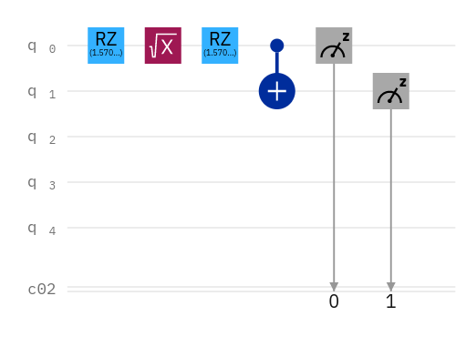

# A Simple circuit using qubit

## The circuit diagram in 5 qubit deivce

To run this on real IBM device, replace the value of `IBM_TOKEN` to your IBM access token.

## The result from qasm simulator

## The result from 5 qubit IBM quantum computer

